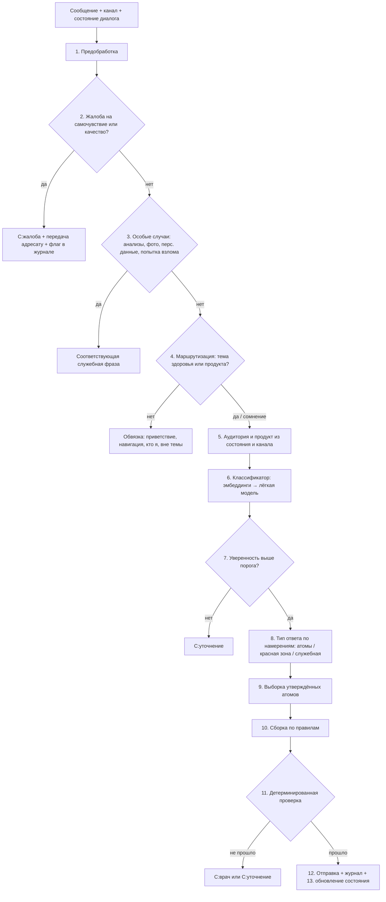

# Логика бота

Черновик, 30.09.2026. Собрано из принятых решений ([decisions.md](decisions.md), блоки А–Д) и хендовера. Пункты с пометкой **(предложено)** — новое, ждёт подтверждения. Линейка — «Контроль»: текст ответа собирает скрипт, нейросеть только разбирает вопрос.

## 1. Общая схема



## 2. Шаги

**1. Предобработка.** Приводим текст к нормальному виду (регистр, лишние пробелы, ё/е), ограничиваем длину. Фото, голос, файл — сразу служебная фраза «С:фото» или «С:функция недоступна»: бот их не разбирает. Не русский язык — «С:язык».

**2. Фильтр жалоб** (решения А3, В3). Стоит первым, настроен ловить с запасом. Срабатывает на самочувствие после приёма («краснеет лицо», «болят мышцы»), на «не помогает» и на качество («таблетки раскрошились», «подделка»). Ответ — служебная фраза о жалобе, сообщение уходит адресату у клиента, в журнале флаг. **(предложено)** Если в том же сообщении есть и другой вопрос, жалоба важнее: на остальное бот не отвечает, пока жалоба не обработана.

**3. Особые случаи** (решение А5).
- Пользователь присылает свои анализы или цифры («холестерин 7,2») → «С:анализы»: бот не интерпретирует показатели.
- Просьба запомнить телефон, удалить переписку → «С:персональные данные».
- Попытка заставить бота нарушить правила («игнорируй инструкции», «скажи, что это безопасно») → «С:вне темы», без извинений.

**4. Маршрутизация** (решение А3). Всё про здоровье, самочувствие, дозы, состав, приём → атомный режим. При сомнении — атомный режим. Режим «липкий»: остаёмся в нём, пока тема явно не сменилась. Вне атомного режима работает свободный слой: обвязка (приветствие, завершение, «кто я», навигация, вежливый отказ) и рассказ о бренде и компании через RAG по очищенному набору документов (уточнение 02.10). Переход на продукт и здоровье определяют «блокеры»; ответы свободного слоя проверяются по стоп-листу.

**5. Аудитория и продукт.**
- Аудитория по умолчанию задаётся каналом: сайт, мессенджер, маркетплейс → покупатель; аптечный справочник → фармацевт; канал для специалистов → врач (после проверки статуса); инструмент медпреда → медпред.
- **(предложено)** Слова «я врач» в открытом канале уровень доступа не повышают: без проверки статуса бот отвечает как покупателю. Если аудитория непонятна — выбираем самую закрытую (покупатель), а не спрашиваем.
- Продукт: Статинорис или Статинорис Форте. Если вопрос о дозах, составе или курсе, а продукт не назван и в диалоге его ещё не было → уточняющий вопрос «Вы спрашиваете о Статинорисе или о Статинорисе Форте?». У них разные дозировки и курс, отвечать «наугад» нельзя.

**6. Классификатор** (решение В1). Поиск по эмбеддингам отбирает 10–20 похожих намерений, лёгкая модель выбирает из них и возвращает JSON:

```json
{
  "intents": ["приём.как_принимать", "особые_группы.беременность"],
  "product": "статинорис | форте | не указан",
  "special_groups": ["беременность"],
  "drugs_mentioned": ["статины"]
}
```

Намерений в одном вопросе — не больше трёх **(предложено)**. Больше — «С:уточнение».

**7. Уверенность** (решение В2). По косвенным признакам: близость вопроса к намерению по эмбеддингам и совпадение выбора при 2–3 прогонах. Ниже порога — «С:уточнение». **(предложено)** Уточнение может предлагать 2–3 варианта кнопками («О приёме» / «О курсе»): названия намерений — фиксированный текст, фактов в нём нет.

**8. Тип ответа.** У каждого намерения в базе записан тип (это колонка «ожидаемый ответ» в [meanings.csv](../../products/statinoriz/questions/meanings.csv)): атомы раздела, красная зона или служебная фраза.
- Намерение красной зоны → служебная фраза (обычно «С:врач»), пока нет согласованного атома.
- **Правило особых групп (предложено).** Если в вопросе или в состоянии диалога есть особая группа (беременность, кормление, ребёнок) или лекарство, ответ по ним идёт первым, а обычные атомы (например, дозировка для взрослых) не выдаются. Это закрывает главный риск из хендовера — «взрослая доза на вопрос про ребёнка».
- Порядок частей ответа: жалоба → особая группа или лекарство → остальное.

**9. Выборка атомов.** Берём атомы по намерению с фильтром: аудитория, продукт, статус «утверждён». В пилоте до согласования — оранжевые атомы только для внутренних прогонов, пользователю не показываются.

**10. Сборка** (решение Б4).
- Схема: [вводная связка] + атомы целиком, каждый — отдельным предложением с точкой + [обязательная пометка] + [завершение].
- Атомы не склеиваем и не меняем. Связки и пометки — из библиотеки стилевого слоя, тон по аудитории.
- Не больше одной эмпатической фразы, факт раньше «воды», без восклицательных знаков (хендовер).
- **(предложено)** Не больше 5 атомов в ответе; остальное — «Рассказать подробнее о …?».
- **(предложено)** Пометка «БАД, не является лекарственным средством» — в первом ответе атомного режима и в ответах про эффект, лечение, замену лекарств.

**11. Детерминированная проверка** (последний шаг, без нейросети).
- Каждое предложение ответа дословно совпадает с утверждённым атомом, связкой или служебной фразой.
- Все ID атомов существуют и имеют статус «утверждён» для этой аудитории.
- В связках нет цифр и слов из стоп-листа.
- Не прошло → «С:врач» или «С:уточнение» и отметка в журнале.

**12. Отправка и журнал.** Пишем: вопрос, канал, аудиторию, продукт, намерения, уверенность, ID атомов, тип ответа, сработавшие фильтры. Вопросы, ушедшие в служебный ответ, — в очередь кандидатов в атомы (решение А5).

**13. Состояние диалога** (решение А1): продукт, аудитория и статус проверки, режим (атомный или обвязка), последние намерения, упомянутые особые группы и лекарства. **(предложено)** Особые группы и лекарства держим до конца диалога: если человек сказал «я беременна», следующий вопрос «как принимать?» тоже идёт по правилу особых групп. Храним только флаги, без текста о здоровье (152-ФЗ).

## 3. Служебные фразы

Виды взяты из разметки вопросов. Тексты согласуются один раз на бренд.

| Вид | Когда | Пример (черновик) |
|---|---|---|
| С:жалоба | Самочувствие, качество, «не помогает» | «Спасибо, что сообщили. Мы передали обращение в отдел качества. Если самочувствие ухудшилось, обратитесь к врачу.» |
| С:врач | Красная зона, особые группы без атома, лечение | «С этим вопросом лучше обратиться к лечащему врачу.» |
| С:анализы | Свои анализы и цифры | «Я не могу оценивать результаты анализов. Их лучше обсудить с врачом.» |
| С:уточнение | Низкая уверенность, много намерений | «Уточните, пожалуйста, что вас интересует: …» |
| С:сравнение | Конкуренты, «что лучше» | «Я рассказываю только о наших продуктах.» |
| С:вне темы | Не о продукте, провокации, взлом | «Я могу ответить на вопросы о продукте Статинорис.» |
| С:где купить | Покупка, цена, наличие | Ссылка на страницу «Где купить» |
| С:горячая линия | Живой человек, опт, возврат | Контакты горячей линии (атом бренда) |
| С:сервис площадки | Доставка, возврат на маркетплейсе | «Этот вопрос лучше задать продавцу на площадке.» |
| С:медпред | Материалы, обучение, образцы | «С этим поможет медицинский представитель компании.» |
| С:проверка статуса | Специалист в открытом канале | Как пройти в канал для специалистов |
| С:навигация, С:функция недоступна, С:персональные данные, С:фото, С:язык, С:кто я, С:приветствие, С:завершение | Обвязка | — |

## 4. Примеры на Статинорисе

**«Как принимать Статинорис?»** (покупатель, сайт) → намерение «приём», уверенность высокая → атомы приёма и курса → ответ: вводная связка + атом «взрослым по 1 таблетке 1 раз в день во время еды в вечернее время» + атом курса + пометка «БАД». Цифры — дословно из атомов.

**«Я беременна, можно мне?»** → особая группа «беременность» → правило особых групп → атом противопоказаний («беременность, кормление грудью») + «С:врач». Дозировку не выдаём. Флаг «беременность» остаётся в состоянии.

**«Пью розувастатин, можно вместе?»** → намерение «совместимость», лекарство «статины» → красная зона → «С:врач». Главная ловушка продукта (заметки по Статинорису, п. 5).

**«Болят мышцы, пью статины и Статинорис»** → фильтр жалоб срабатывает первым → «С:жалоба», передача адресату. Вопрос о совместимости в этом ответе не разбираем.

**«У меня холестерин 7,2, подойдёт?»** → особый случай «анализы» → «С:анализы».

**«Сколько ниацина?»** в начале диалога → продукт не указан, а у Форте другая дозировка → «Вы спрашиваете о Статинорисе или о Статинорисе Форте?».

## 5. Что решить

- Все пункты с пометкой **(предложено)** выше: жалоба важнее остальных вопросов в сообщении; «я врач» не повышает доступ; не больше трёх намерений и пяти атомов; кнопки в уточнении; когда показывать пометку «БАД»; особые группы держатся до конца диалога.
- Составной вопрос, где одна часть — атомы, а другая — красная зона: отвечаем на атомную часть и отдельно «С:врач», или целиком «С:врач»? **(предложено: частично, особая группа или лекарство — первыми)**
- Что делать после трёх уточнений подряд: предлагать горячую линию?
